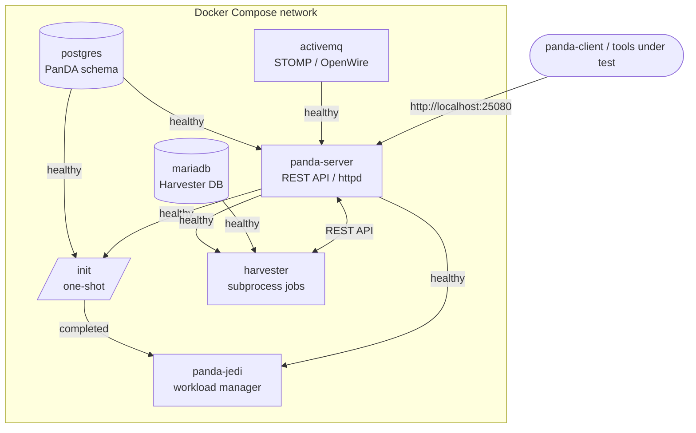
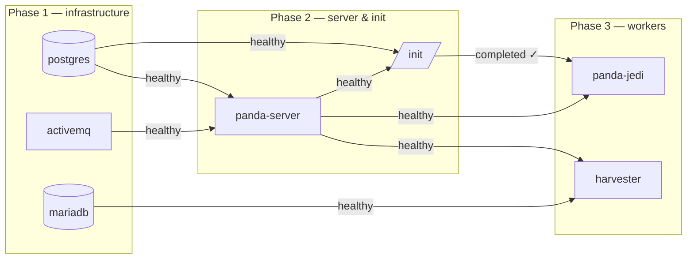
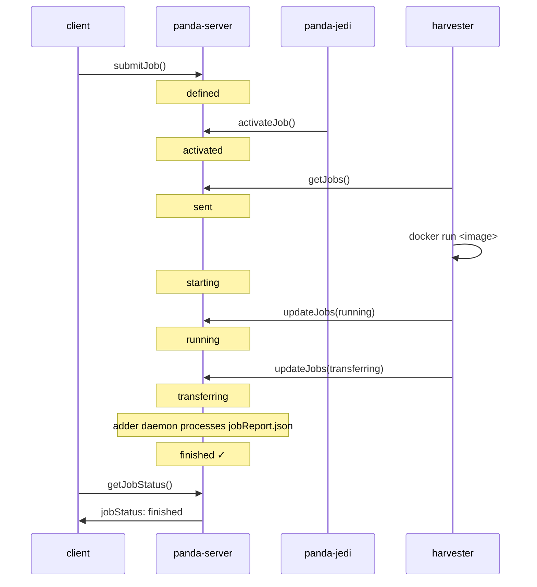

# Architecture & Design

## Design goals

panda-compose provides a **self-contained, single-host PanDA deployment** for:

- Development and debugging of tools that integrate with PanDA (executors, plugins, workflow managers)
- CI smoke testing of PanDA-dependent code without a production cluster
- Experimentation with PanDA configuration before deploying to [panda-k8s](https://github.com/PanDAWMS/panda-k8s)

The stack is intentionally minimal: all services run in Docker containers with no
external dependencies (no Rucio, no ATLAS grid services, no token broker).

## Service topology

## Service dependency order

## Component descriptions

### postgres — PanDA database

Uses `ghcr.io/pandawms/panda-database:latest`, which ships with the full PanDA + JEDI
PostgreSQL schema pre-installed. On first run the `panda_db_init.sh` entrypoint script
creates the `panda` database role using `PANDA_DB_PASSWORD`.

The schema uses multiple schema namespaces mapped to PostgreSQL schemas:
`DOMA_PANDA`, `DOMA_PANDAMETA`, `DOMA_PANDAARCH`, `DOMA_DEFT`.
An additional `atlas_panda` schema is created by the `init` service as a view alias
over `doma_panda`, satisfying Oracle-legacy references in PanDA/JEDI code.

### activemq — message broker

Uses `ghcr.io/pandawms/panda-activemq:latest`. The `panda-server` and `panda-jedi`
daemons exchange job status events over STOMP (port 61613). OpenWire (port 61616)
is also exposed. The web console is available at `http://localhost:8161/admin/`.

The image `CMD` defaults to `sleep infinity`; we override it to
`/opt/activemq/bin/run-activemq-services`. The `JAVA_TOOL_OPTIONS` env var disables
a JDK 18 cgroup v2 detection bug (JDK-8281631) that would otherwise crash the JVM.

### panda-server — REST API

Uses `ghcr.io/pandawms/panda-server:latest` (Apache httpd + mod_wsgi + PanDA server
Python code). The startup sequence mirrors the panda-k8s StatefulSet pattern:

1. Copy sandbox scripts from `/opt/panda/sandbox/` to `/data/panda/`
2. Run `process_template.py` to expand `${VAR}` in `*.template` config files
3. Remove stale lock/PID files from any previous container run
4. Execute `run-panda-services`

The server is accessible at `http://localhost:25080/server/panda` (HTTP only in dev).
`PANDA_AUTH=None` disables all authentication — no tokens or certificates required.

### panda-jedi — workload manager

Uses `ghcr.io/pandawms/panda-jedi:latest`. JEDI runs several daemons:

- **JediMaster** — process supervisor
- **JobGenerator** — activates `defined` jobs → `activated`
- **TaskBroker** — assigns tasks to sites (may crash on startup due to an argument-order
  bug in `GenJobBroker.__init__`; non-fatal for direct job submission)
- **WatchDog**, **PostProcessor**, etc.

JEDI depends on the `init` service completing successfully to ensure the
`PANDA_COMPOSE_LOCAL` queue is registered and the `pandadb_version` JEDI row exists
before it starts reading schedconfig.

### mariadb — Harvester database

Uses `mariadb:10.11` (standard LTS image). Harvester stores its internal state
(worker records, job mappings, statistics) in MariaDB. The schema is created
automatically by Harvester on first startup via its `make_tables` migration.

### init — queue registration (one-shot)

The `init` service runs `scripts/setup-queue.sh` once after `postgres` and
`panda-server` are healthy, then exits 0. It:

1. Inserts the `PANDA_COMPOSE_LOCAL` site into `schedconfig` and `cloudconfig`
2. Inserts a JEDI version row into `pandadb_version` (required by JEDI startup)
3. Creates the `atlas_panda` schema with 261 VIEWs over `doma_panda` tables

`panda-jedi` has `depends_on: init: service_completed_successfully`, so it will not
start until the init container exits 0.

### harvester — job executor

Uses `ghcr.io/hsf/harvester:latest`. In this stack, Harvester is configured to use
Docker-based plugins that launch job containers on the host Docker daemon:

| Plugin | File | Purpose |
|---|---|---|
| `DockerSubmitter` | `config/harvester/plugins/docker_submitter.py` | Starts one Docker container per worker; image from job `container_name` param or queue default (`alpine:latest`) |
| `DockerMonitor` | `config/harvester/plugins/docker_monitor.py` | Polls container state; maps `exited(0)` → `ST_finished`, non-zero → `ST_failed` |
| `DummyStager` | *(built-in)* | No-op output staging (no Rucio) |
| `BaseMessenger` | *(built-in)* | Minimal messenger; `accessPoint` provides the worker working-directory root |

The host Docker socket (`/var/run/docker.sock`) is bind-mounted into the harvester
container so the `DockerSubmitter` plugin can call the Docker API directly.

## Job lifecycle

End-to-end timing for a trivial job (e.g., `/bin/echo`):

| Stage | Typical duration |
|---|---|
| `defined` → `activated` | 30–90 s (JEDI JobGenerator cycle) |
| `activated` → `sent` → `starting` | ~10 s (Harvester getJobs + submit) |
| `starting` → `transferring` | ~5 s (worker runs and writes report) |
| `transferring` → `finished` | up to 6 min (adder daemon loop interval) |
| **Total** | **2–8 minutes** |

## Docker plugin design

The Harvester Docker plugins run each job in its own container on the host Docker
daemon. The harvester container has the Docker socket bind-mounted at
`/var/run/docker.sock`.

`docker_submitter.py`:
- Receives a list of `WorkSpec` objects from Harvester
- For each worker, calls `docker.run()` with the image from the job's
  `container_name` parameter (falling back to the queue's `containerImage`)
- Sets `batchID` to the Docker container ID for the monitor to track
- Returns `ST_submitted` immediately; the container runs detached

`docker_monitor.py`:
- Receives a list of `WorkSpec` objects from Harvester
- Looks up each container by `batchID`
- Maps container state: `running`/`restarting` → `ST_running`;
  `exited` with code 0 → `ST_finished`; `exited` with non-zero → `ST_failed`
- Removes terminal containers automatically after status is recorded

The transformation binary and parameters come from the PanDA job descriptor
(`--transformation`, `--params`). Any Docker image reachable from the host can
be used; specify it per-job with `--container IMAGE`.

## Subprocess plugin design (secondary)

The repository also includes simpler subprocess plugins that run jobs as
subprocesses inside the harvester container itself. These are available in
`scripts/` but are not the default queue configuration.

`subprocess_submitter.py`:
- Receives a list of `WorkSpec` objects from Harvester
- For each worker, writes a `pandaJobData.out` file from the job descriptor
- Launches `panda-worker.sh` with `subprocess.Popen` (non-blocking)
- Returns `ST_submitted` immediately

`subprocess_monitor.py`:
- Receives a list of `WorkSpec` objects from Harvester
- For each worker, checks whether `jobReport.json` exists in the worker directory
- If present, reads `exitCode` and returns `ST_finished` or `ST_failed`

`panda-worker.sh`:
- Parses `pandaJobData.out` (CGI-encoded key-value format) using `grep`
- Sets `TRANSFORM` and `JOB_PARAMS` from the descriptor
- Runs `exec $TRANSFORM $JOB_PARAMS`
- On exit, writes `{"exitCode": N, "exitMsg": "..."}` to `jobReport.json`
